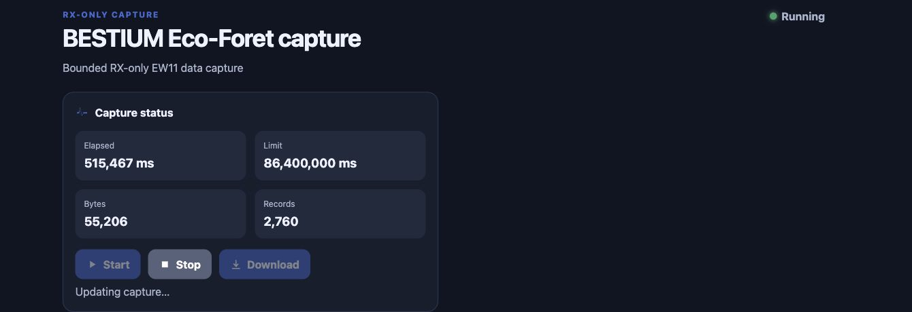

# BESTIUM Eco-Foret Home Assistant App

Experimental Home Assistant App for bounded wallpad capture, protocol debugging,
and guarded transmission through an EW11 TCP gateway. It is an engineering clean
rewrite and does not reuse legacy product source.



## What it does

- Opens one TCP connection to the configured EW11 endpoint and records inbound
  read chunks without writing wallpad command payloads.
- Replaces a receive-idle TCP connection inside the same capture without
  resetting its original duration, byte, record, or sequence progress.
- Enforces independent duration, byte, and record ceilings, with at most one
  active capture.
- Persists newline-delimited JSON under the Home Assistant App `/data` boundary.
- Shows live counts and at most 20 recent records in an admin-only Ingress
  dashboard instead of rendering the complete capture in the browser.
- Finalizes partial data when Stop is selected and enables Download only after
  finalization.
- Writes summary lifecycle information to App logs without raw packet payloads.
- Monitors current-generation device evidence and exposes default-disabled,
  operator-gated preview/commit controls for the bounded debug actions.

## Install from the repository URL

This requires a Home Assistant installation that provides Apps, such as Home
Assistant OS.

1. In Home Assistant, open **Settings → Apps → App store**.
2. Open the top-right menu, choose **Repositories**, and add:

   ```text
   https://github.com/jaemyeong/homeassistant-bestium-eco-foret
   ```

3. Refresh the App store if necessary, open **BESTIUM Eco-Foret Home Assistant
   App**, and select **Install**.

To keep the App in Home Assistant's sidebar, enable **Show in sidebar** on its
information page after installation. The App supplies the `BESTIUM Capture`
panel title and radio-tower icon, but Home Assistant stores sidebar visibility
as a per-user preference rather than an App-forced setting.

The repository follows Home Assistant's documented
[third-party repository installation](https://www.home-assistant.io/common-tasks/os/#installing-a-third-party-app-repository)
and [App repository layout](https://developers.home-assistant.io/docs/apps/repository/).

## Configure

The EW11 host and port are required. Numeric options have bounded defaults. The
host must be a bare hostname or IP address without a URL scheme, whitespace, or
`/` or `\` path separators.

| Option | Default | Accepted range |
| --- | ---: | ---: |
| `ew11_host` | required | 1–253 characters |
| `ew11_port` | required | 1–65,535 |
| `connect_timeout_ms` | 3,000 | 100–30,000 ms |
| `idle_timeout_ms` | 30,000 | 5,000–3,600,000 ms |
| `capture_duration_ms` | 5,000 | 100–86,400,000 ms |
| `maximum_bytes` | 65,536 | 1–67,108,864 bytes |
| `maximum_records` | 1,000 | 1–1,000,000 records |

Transmission is disabled by default. To enable it, set `transmit_user_id` to the
exact Home Assistant user ID allowed to operate the Ingress controls, then enable
the required TX tier. Starting with `0.2.1`, if any TX toggle is enabled without
that ID, the App starts normally but evaluates all three TX toggles as disabled.

The App is marked `experimental` and `manual_only`; it will not start
automatically at Home Assistant boot.

## Capture and download

1. Save the configuration and start the App manually.
2. Open **Web UI** from the App information page.
3. Select **Start** once. The dashboard disables Start while the capture is
   active.
4. Select **Stop** at any time, or wait for the first configured ceiling to be
   reached.
5. After finalization completes, select **Download** to retrieve the NDJSON file.

Each NDJSON line describes one observed TCP read chunk, not a decoded protocol
frame:

```json
{"sequence":0,"receivedAtMs":0,"byteLength":3,"hex":"000102"}
```

Raw captures may contain household or device activity. Keep downloaded files
private and do not commit them to this public repository.

## Security and current scope

- Home Assistant authenticates the Ingress session; the panel is restricted to
  administrators and the App accepts Ingress traffic only from the Supervisor
  gateway address.
- No public port mapping, host networking, Docker API access, full access, or
  privileged mode is requested.
- Transmission is default-disabled and remains fail-closed unless the configured
  Home Assistant user ID matches the trusted Ingress user. Gas OPEN is not
  exposed or encoded; gas control is CLOSE-only.
- Protocol labels and inferred command candidates are experimental debugging
  aids, not Home Assistant entities or proof of device behavior.
- Version `0.1.2` installation, startup, Ingress, and bounded receive behavior
  have been observed on one local Home Assistant OS installation; portability to
  other hardware and environments is not yet established.
- Version `0.1.3` is published on this repository's public `main` after
  static/native/adversarial acceptance. Its 34 native tests include lossless
  paused-transport buffering and timeout re-arming across idle timeout events.
  Home Assistant update and live reconnect validation remain pending.
- Version `0.2.0` added the debug monitor and guarded TX surfaces. Version `0.2.1`
  repairs startup when TX toggles are enabled without `transmit_user_id`; live
  Home Assistant and device behavior remain separate verification gates.

## Development

The project uses Node.js 24 and the native test runner, with no runtime package
dependencies.

```sh
npm test
```

See [CHANGELOG.md](CHANGELOG.md) for the evidence-backed milestone history.
